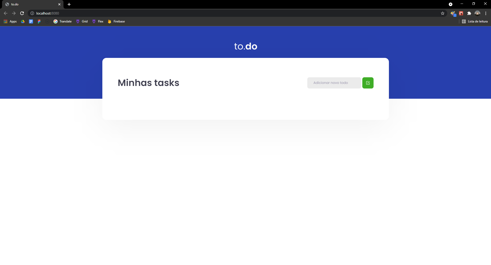
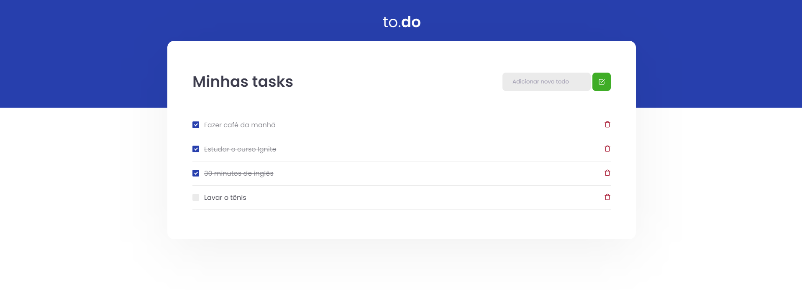

# tasks

<h2>Aplicação</h2>

Uma aplicação de gerenciar as tarefas.

<blockquote>
  <cite>Rocketseat</cite>
  
A aplicação está praticamente completa, é necessário criar as funcionalidades de adicionar uma tarefa e aparecer na tela, de marcar a tarefa concluída e de excluir a tarefa

</blockquote>
<h3>Como a aplicação ficou:</h3>

---

<h4>Como rodar a aplicação?</h4>
<ol>
  <li>Necessário clonar o repositório "code" como preferir.</li>
  <li>Abrir a pasta no VsCode.</li>
  <li>Abrir o terminal e rodar a aplicação com "yarn dev".</li>
</ol>
